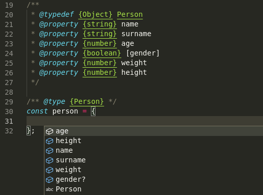

Há algum tempo venho utilizado o JSDoc para além de documentações técnicas em trechos de códigos. Muita gente não sabe, mas ele é extremamente poderoso e pode fazer muito mais do que você imagina. Então hoje abordarei um pouco mais a fundo sobre e também como utilizá-lo como sistema de tipos de seu projeto, não precisando migrar todo o projeto JavaScript para TypeScript para tipar seu código.

## O que é o JSDoc?

O [JSDoc](https://jsdoc.app) é um projeto JavaScript criado com o propósito de documentar APIs de aplicações ou bibliotecas JavaScript. Existem muitas ferramentas assim fora do ambiente JS, como o JavaDoc no mundo Java, phpDocumentor para PHP e Doxygen para C++.

A notação de uma JSDoc é simples, sendo parecida com um comentário multi-linhas do JavaScript tendo apenas um `*` a mais (`/** */`):

```javascript
/**
 * Função responsável por retornar um componente exibindo o
 * nome da pessoa usuária.
 *
 * @param {User} user
 * @returns {JSX.Element}
 */
function renderUserName({ name }) {
  return <Text>{name}</Text>
}
```

Podemos ver então que criamos uma documentação básica, explicando o propósito a qual a função foi criada. Mas também percebe-se o seguinte, existem tipos declarados no parâmetro e no retorno da mesma. Isto é muito importante, pois é possível declarar tipos através de JSDocs, veja o exemplo do tipo `User` que usamos anteriormente:

```javascript
/**
 * Tipo da entidade de Pessoa Usuária.
 *
 * @typedef User
 * @property {string} name - Nome da pessoa usuária
 * @property {string} birthdate - Data de nascimento da pessoa usuária
 * @property {string} birth - Data de nascimento da pessoa usuária
 */
```

## VS Code + JSDoc = TypeScript

O [Visual Studio Code](https://code.visualstudio.com/) possui uma ótima integração com JSDoc, possibilitando debugar tipos enquanto escreve-se códigos JavaScript. Isto porque a [Intelissense do VSCode](https://code.visualstudio.com/docs/nodejs/working-with-javascript#_intellisense) utiliza o [serviço de JavaScript: _Salsa_](https://github.com/microsoft/TypeScript/wiki/JavaScript-Language-Service-in-Visual-Studio), desenvolvido pelo time do TypeScript. Este serviço torna a _Intelissense_ muito mais inteligente, possibilitando que além de documentar seu código JavaScript com as JSDoc, você pode também tipá-lo. Caso você você queira saber mais, vale a pena acessar [a página que explica mais sobre o _Salsa_ na documentação do TypeScript](https://github.com/microsoft/TypeScript/wiki/JavaScript-Language-Service-in-Visual-Studio#-intellisense-based-on-jsdoc).

Tendo isto tudo posto, podemos percorrer algumas notações do JSDoc.

## Notações do JSDocs

Como dito anteriormente, para declarar uma JSDoc basta utilizar o bloco de documentação `/** */`. Dentro dele você pode escrever um texto plano (descrevendo seu trecho de código) e também _tags_ JSDoc. Começando a nossa lista pela notação `@typedef`.

### @typedef

A _tag_ `@typedef` é equivalente a uma declaração de [_type alias_](https://www.typescriptlang.org/docs/handbook/2/types-from-types.html) no TypeScript. Ou seja, esta tag é muito utilizada para declaração de tipos mais complexos e estruturas de múltiplos campos no seu código.

Veja o exemplo abaixo de um _type alias_ em TypeScript:

```typescript
type Person = {
  name: string;
  surname: string;
  age: number;
  gender?: boolean;
  weight: number;
  height: number;
}
```

O _type alias_ acima declara ao todo seis propriedades diferentes para o tipo `Person` com os mais variados tipos, para utilizarmos este tipo em um código JavaScript podemos utilizar o `@typedef` aliado ao `@property`, veja a seguir:

```typescript
/**
 * Tipo da entidade `Person`
 *
 * @typedef {Object} Person
 * @property {string} name
 * @property {string} surname
 * @property {number} age
 * @property {boolean} [gender]
 * @property {number} weight
 * @property {number} height
 */
```

Veja que a sintaxe muda um pouco, vindo os tipos antes dos nomes das propriedades. Além disto, para declarar tipos opcionais, como o caso de `gender` para o caso da pessoa não querer declarar seu gênero, podemos utilizar colchetes em volta do nome da propriedade para torná-la opcional.

Vale ressaltar que o `@property` tem seu diminutivo `@prop`, deixando mais simples a leitura da sua definição de tipo.

### @type

A _tag_ `@type` é usada para definirmos o tipo de uma expressão, ou seja, se quisermos utilizar o tipo `Person` declarado anteriormente, podemos apenas declarará-lo da seguinte forma:

```typescript
/**
 * @type {Person}
 */
const person = {};
```

Para este caso poderíamos também utilizar a _tag_ `@constant` para o caso de constantes. 

```typescript
/**
 * @constant
 * @type {Person}
 */
const person = {};
```

Desta forma, ao digitar `Ctrl` + `Espaço` veremos o seguinte:



Como demonstrado na imagem anterior, o Intelissense através do JSDoc consegue inferir tipos do JavaScript.

O `@type` também disponibiliza declarações _inline_, podendo declarar tipos que não serão reutilizados através da sintaxe TypeScript:

```typescript
/**
 * @type {{ x: number, y: number }} Point
 */
```

### @callback

Para casos onde é necessário declarar um tipo para uma função, o melhor a se fazer é utilizar o `@callback` junto às tags `@param` e `@returns`, 
que como o nome já diz são responsáveis, respectivamente, pelos tipos dos parâmetros e pelo retorno da sua função. O exemplo a seguir detalha uma
função que contém um parâmetro único e um retorno:

```typescript
/**
 * @callback FilterLegalAgePersons
 * @param {Person[]} persons
 * @returns {(Person & { fullName: string })[]}
 */

/** @type {FilterLegalAgePersons} */
 const filterLegalAgePersons = (persons) => persons
  .map(({ name, surname, ...person }) => ({
    fullName: `${name} ${surname}`,
    name,
    surname,
    ...person,
  }))
  .filter(({ age }) => age >= 18)
```

É possível também declarar funções _curry_, basta neste caso sua função retornar a funções separadamente, veja o exemplo:

```typescript
/**
  * @param {BrowserHistory} history
  * @returns {(route: string) => void}
  */
const push = history => route => history.push(route);
```

Desta forma é possível ver que o tipo criado para a nossa função é o seguinte:

```typescript
const push = (history: BrowserHistory) => (route: string) => void
```

Com o tipo declarado para nossas funções, a utilização destas fica muito mais simples. Além disto as deixamos documentadas facilitando
a compreensão do código escrito.

### @template

E por último, podemos declarar tipos genéricos através do JSDoc, para isto devemo utilizar a tag `@template` que é responsável por criar
declarações de tipos genéricos, veja o exemplo a seguir em TypeScript:

```typescript
function useState<T>(initialState: T) {
  let state = initialState;

  const setState = (newState: T) => {
    state = newState
  }

  return [
    state,
    setState
  ]
}
```

O código acima está em TypeScript, não existem tipos genéricos em JavaScript porém podemos declará-lo através de uma JSDoc, o exemplo a seguir demonstra este uso:

```javascript
/**
 * Função utilitária criado com o propósito de controlar estados
 * 
 * @template T
 * @param {T} initialState 
 * @returns {[T, (newState: T) => void]}
 */
function useState(initialState) {
  let state = initialState;

  /**
   * Função responsável por definir novo estado.
   * 
   * @param {T} newState
   */
  const setState = (newState) => {
    state = newState
  }

  return [
    state,
    setState
  ]
}
```

No exemplo é possível ver que a declaração de um `@template` pode ser reutilizado dentro de blocos de código diferentes.

## Conclusão

Com todos estes exemplos é possível ver que não é necessário ter que realizar um processo migratório (e dependendo da sua base de código: complexo) para declarar e utilizar tipos em seu projeto. As JSDocs facilitam muito o trabalho de declarar tipos e documentações de funções, variáveis, constantes e o que precisar ser documentado em seu código JavaScript! Caso queira saber mais leia a [documentação do TypeScript que descreve o JSDoc](https://www.typescriptlang.org/docs/handbook/jsdoc-supported-types.html), além da própria documentação do [JSDoc](https://jsdoc.app/).

Agradeço pela sua atenção até aqui, não esqueça de compartilhar o post com seus amigos! Além disto minha DM está sempre aberta para discutirmos sobre no meu twitter [@mechamobau](https://twitter.com/mechamobau). Obrigado pelos peixes e até próxima!